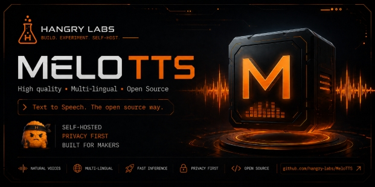

<p>
  <a href="https://nuggies.website/">
    
  </a>
</p>

# Hangry Labs Melo T T S

Easy-to-run text-to-speech Docker images with a browser UI and HTTP API included.

This Hangry Labs fork is made for ease of use. The aim is that anyone should be able to run text to speech without friction: a person trying it at home, a developer wiring it into an app, or a professional evaluating it for a production environment. Install Docker, run one command from Quick Start, open the local link, and start generating speech.

You get:
- A browser UI for manual text-to-speech generation
- An HTTP API for your own applications and tools
- No manual Python, model, or audio dependency setup
- Full multilingual images and smaller EN-focused images
- Offline-friendly usage: download an image once, keep it, and run it later without relying on live model downloads

Official Docker images are published here: [hangrylabs/melotts on Docker Hub](https://hub.docker.com/r/hangrylabs/melotts/tags).

Voice examples are available here: [hangry-labs.github.io/MeloTTS/examples](https://hangry-labs.github.io/MeloTTS/examples/).

Hangry Labs home: [nuggies.website](https://nuggies.website/).

---

## Voice Examples

Preview MP3 samples from the full multilingual image:

[Open the voice examples page](https://hangry-labs.github.io/MeloTTS/examples/)

GitHub does not render embedded audio players directly in README files, so direct MP3 links are also provided below.

| Language | Sample |
| --- | --- |
| English British | [Listen to MP3](examples/melotts-en-br.mp3) |
| English newest | [Listen to MP3](examples/melotts-en-newest.mp3) |
| English v2 | [Listen to MP3](examples/melotts-en-v2.mp3) |
| English | [Listen to MP3](examples/melotts-en.mp3) |
| English Indian | [Listen to MP3](examples/melotts-en-india.mp3) |
| English Australian | [Listen to MP3](examples/melotts-en-au.mp3) |
| English American | [Listen to MP3](examples/melotts-en-us.mp3) |
| English default | [Listen to MP3](examples/melotts-en-default.mp3) |
| Spanish | [Listen to MP3](examples/melotts-es.mp3) |
| French | [Listen to MP3](examples/melotts-fr.mp3) |
| Chinese | [Listen to MP3](examples/melotts-zh.mp3) |
| Japanese | [Listen to MP3](examples/melotts-jp.mp3) |
| Korean | [Listen to MP3](examples/melotts-kr.mp3) |

---

## Quick Start

```bash
docker run -p 8888:8888 --gpus all hangrylabs/melotts:latest
```

EN-focused build (smaller target image):

```bash
docker run -p 8888:8888 --gpus all hangrylabs/melotts:latest_en
```

Run on a specific GPU (example: GPU index `1`):

```bash
docker run -p 8888:8888 --gpus "device=1" hangrylabs/melotts:latest
```

Then open: **[http://localhost:8888](http://localhost:8888)**

---

## API Usage Example

```bash
curl -X POST "http://localhost:8888/tts/convert/tts" \
  -H "Content-Type: application/json" \
  -d '{"text":"Hello world!","language":"EN","speaker_id":"EN-BR"}' \
  -o output.wav
```

The API remains backward compatible: when `format` is omitted, it returns WAV audio as before.
To request a smaller response, add `format` with one of `mp3`, `flac`, or `ogg`:

```bash
curl -X POST "http://localhost:8888/tts/convert/tts" \
  -H "Content-Type: application/json" \
  -d '{"text":"Hello world!","language":"EN","speaker_id":"EN-BR","format":"mp3"}' \
  -o output.mp3
```

Available formats are exposed at `GET /tts/formats`.
The web UI defaults to MP3 downloads because it is a more practical size for interactive use.

---

## About This Fork

This project is an independently maintained fork of the original [MeloTTS](https://github.com/myshell-ai/MeloTTS) by [Wenliang Zhao](https://github.com/wl-zhao), [Xumin Yu](https://github.com/yuxumin), and [Zengyi Qin](https://github.com/Zengyi-Qin).
The original work is licensed under the MIT License, and we thank the authors for their excellent research and contributions.

While the original MeloTTS is an impressive research project, this Hangry Labs fork focuses on making it simple to run and integrate: Docker image, included UI, and API support out of the box.

License and attribution are preserved in [`LICENSE`](LICENSE). The original MeloTTS copyright remains with MyShell.ai; this fork adds separate Hangry Labs copyright for the Docker packaging, Web UI/API integration, documentation, release tooling, and other modifications.

⚠️ **Note:** This project is maintained for usability and convenience by a single developer. It is not a production-hardened system and may require additional work for critical deployments.

✅ **Offline Mode:** Supported when models are baked into the Docker image or mounted through a volume.

## Support & Issues
If you encounter bugs, have feature requests, or need help using Hangry Labs Melo T T S:
- Please open a new [GitHub Issue](https://github.com/hangry-labs/MeloTTS/issues) with as much detail as possible
- Include error messages, logs, and reproduction steps if applicable
- For general questions or ideas, you can also use the [Discussions](https://github.com/hangry-labs/MeloTTS/discussions) tab

---

## Docker Features
- Pinned dependencies for reproducible builds
- Preloaded models for instant offline use (optional)
- GPU acceleration when available
- HTTP API + web UI in one container
- Split image strategy: full multilingual images use the plain version tag; EN-focused images use `*_en`

---

## Docker Hub
You can explore all available Hangry Labs Melo T T S container images on [Docker Hub](https://hub.docker.com/r/hangrylabs/melotts/tags).

This is useful if you want to:
- Select a specific version of MeloTTS for compatibility
- Check the latest available builds before pulling
- Verify image tags for deployment

Current tag pattern:
- EN-focused image: `latest_en`, `<version>_en`
- Full multilingual image: `latest`, `<version>`

---

## 📜 Version History

### v0.0.9 (in development)
- Moved the active Docker runtime/build baseline from `python:3.10-slim` to `python:3.11-slim`.
- Raised package metadata from `python_requires>=3.10` to `python_requires>=3.11`.
- Refreshed dependency pins for the Python 3.11 line, including newer `numpy`, `pandas`, and `networkx` pins.
- Validated the EN-focused Docker build on Python 3.11 with `task imagesmall`, `python -m pip check`, and `task localapi`.

### v0.0.8 (10.05.2026)
- Scope: runtime-focused cleanup for the Docker UI/API fork.
- Removed unused upstream training surfaces, including training scripts/modules, training example data, legacy script-style package tests, and original upstream docs that no longer matched this fork.
- Trimmed runtime helper code by reducing `melo/utils.py` to inference text preparation, config loading, and `HParams`.
- Removed stale phonemizer generation artifacts and notebook files that were not read by runtime synthesis.
- Cleaned stale imports, unused locals, and unreachable flow-layer code found by lint checks.
- Improved Taskfile API readiness checks by retrying transient startup errors such as `Empty reply from server`.
- Reworked the UI into a Kokoro-style Gradio layout while keeping MeloTTS language, speaker, preset, and advanced synthesis controls.
- Added text metrics, per-language random quotes, voice inventory, synthesis presets, advanced controls, Gradio audio waveform preview, runtime metadata, favicon/brand icon, and richer API documentation links.
- Added `/tts/status`, `/tts/defaults`, `/tts/voices`, `/tts/metrics`, and `/tts/purge` endpoints for the new UI and companion integrations.
- Added backward-compatible optional API output formats: default WAV plus MP3, FLAC, and Ogg Vorbis via `format`, with discovery at `/tts/formats`.
- Added an output format selector to the Gradio UI; the UI defaults to MP3 while the API remains WAV-by-default for old clients.
- Modernized the runtime dependency stack using `requirements.in` + resolved pins in `requirements.txt`; key validated versions include `gradio==6.14.0`, `fastapi==0.136.1`, `starlette==1.0.0`, `pydantic==2.13.4`, `torch==2.11.0`, `torchaudio==2.11.0`, `transformers==5.8.0`, `numpy==2.2.6`, and `soundfile==0.13.1`.
- Normalized package metadata versioning in `setup.py` so display versions like `v0.0.8-SNAPSHOT` install as valid Python package versions such as `0.0.8.dev0`.
- Added `task release` backed by the root snapshot `VERSION` file, and corrected Docker release tags so the full image publishes as `<version>` while the EN-focused image publishes as `<version>_en`.
- Expanded rapid local iteration tasks so `task localrun`, `task localdev`, and `task localapi` bind-mount `melo/app.py`.
- Documentation: corrected API examples to use `/tts/convert/tts` JSON payloads and documented the current runtime-only scope.
  ```bash
  docker run -p 8888:8888 --gpus all hangrylabs/melotts:v0.0.8_en
  docker run -p 8888:8888 --gpus all hangrylabs/melotts:v0.0.8
  docker run -p 8888:8888 --gpus "device=1" hangrylabs/melotts:v0.0.8_en
  ```


### v0.0.7 (29.03.2026)
- Upgraded Docker runtime/build baseline to Python 3.10 (`python:3.10-slim`) and aligned packaging with `python_requires>=3.10`.
- Reworked app versioning/build metadata:
  - Root `VERSION` file is now the single version source of truth.
  - Build metadata is generated at image build time (no hardcoded `BUILD_ID`) and exposed in UI/API.
- Upgraded web stack to newer compatible releases: `gradio==4.44.1`, `gradio-client==1.3.0`, `fastapi==0.115.12`, `starlette==0.46.2`, `typer==0.12.5`.
- Applied large dependency/security refresh with pinned versions for reproducible builds, including network/security-sensitive packages such as `requests==2.32.4`, `urllib3==2.3.0`, `certifi==2025.6.15`, plus broad runtime library updates.
- Added/kept compatibility guardrails for stability:
  - `markupsafe` remains on 2.x for Gradio compatibility.
  - `huggingface-hub==0.21.4` and `filelock==3.13.1` remain constrained by `cached-path==1.6.2`.
- Improved offline reliability and startup resilience:
  - Build-time preload profiles (`EN_ONLY` / `FULL`) with retry + strict/non-strict controls.
  - NLTK resources required for EN synthesis (including `averaged_perceptron_tagger_eng` and `cmudict`) are preloaded during image build for offline-ready runs.
- Fixed Gradio 4.x UI regressions after upgrades (language/speaker loading + synth output compatibility) while keeping API behavior stable.
- Split Docker release flow into EN and FULL image tracks/workflows (`<version>_en`, `<version>`) to improve build/release flexibility.
- Run with:
  ```bash
  docker run -p 8888:8888 --gpus all hangrylabs/melotts:v0.0.7_en
  docker run -p 8888:8888 --gpus all hangrylabs/melotts:v0.0.7
  docker run -p 8888:8888 --gpus "device=1" hangrylabs/melotts:v0.0.7_en
  ```
  https://hub.docker.com/r/hangrylabs/melotts

### v0.0.6 (27.03.2026)
- Model loading is now much faster (from ~30 seconds down to only a few seconds in testing).
- Added working RTX 50-series (`sm_120`) support in the Docker setup.
- Added GPU selection support for Docker runs, so you can choose which GPU to use.
- Improved build resilience for model preloading during Docker image creation.
- Run with:
  ```bash
  docker run -p 8888:8888 --gpus all hangrylabs/melotts:v0.0.6
  ```

### v0.0.5 (27.03.2026)
- Added more English model options (including V2 and V3 variants).
- Added UI tabs for `UI Playground` and `API Docs`.
- Added build/version badge in UI (top-right) via `APP_VERSION` and `BUILD_ID`.
- Added memory management in UI (`Purge others`) to release non-selected language models.
- Improved API documentation visibility directly inside the app (`/` -> API Docs tab + `/tts/docs`).
- Updated release planning: V2/V3 scope completed; deferred separate base-repo split plan.
- Run with:
  ```bash
  docker run -p 8888:8888 --gpus all hangrylabs/melotts:v0.0.5
  ```

### v0.0.4 (09.08.2025)
- **Dependency updates** for improved performance and stability.
- **Full offline support** — all required models are now baked into the image.
- **Model overwrite option**: set `MELOTTTS_MODELS` to point to your custom model folder.
- **Smaller image size** via optimized multi-stage Docker build.
- Run with:
  ```bash
  docker run -p 8888:8888 --gpus all hangrylabs/melotts:v0.0.4

### v0.0.3 (25.07.2025)
- Optimized docker build to use layer caching so we can build stuff fast after the initial build
- Expanded ping to include version and build
- Expanded UI with sdp_ratio, noise_scale and noise_scale_w
- Expanded API with sdp_ratio, noise_scale and noise_scale_w
- Corrected faulty version dates
- Updated documentation
- Run with:
  ```bash
  docker run -p 8888:8888 --gpus all hangrylabs/melotts:v0.0.3`

### v0.0.2 (22.06.2025)
- Enable API calls together with UI
- run with
  ```bash 
  docker run -p 8888:8888 --gpus all hangrylabs/melotts:v0.0.2`
- run for english only
    ```bash 
    docker run -p 8888:8888 -e TTS_LANGUAGES=EN hangrylabs/melotts:v0.0.2`
- run for english and japanese
    ```bash 
    docker run -p 8888:8888 -e TTS_LANGUAGES=EN,JP hangrylabs/melotts:v0.0.2`
- run for english with gpu support named melotts_gpu_en
    ```bash 
    docker run -p 8888:8888 --gpus all -e TTS_LANGUAGES=EN --name melotts_gpu_en hangrylabs/melotts:v0.0.2`

### v0.0.1 (21.06.2025)
- Initial release
- Basic TTS functionality
- Support for English (Default, US, BR, India, AU)
- Docker support for both CPU and GPU
- Web interface on port 8888 (http://localhost:8888/)
- Run with
  ```bash 
  docker pull hangrylabs/melotts:v0.0.1`

---

## 🛠 Developer Notes
If you’re interested in building MeloTTS locally, testing changes, or working directly on the codebase, I have included additional technical details and tips in [`notes.md`](./docs/notes.md).

This file contains guidance for:
- Local environment setup
- Dependency management
- Testing workflows
- Build & Docker optimization notes

---

## 📜 License

This fork is licensed under the [MIT License](LICENSE).  
Original work by Wenliang Zhao, Xumin Yu, and Zengyi Qin in [MeloTTS](https://github.com/myshell-ai/MeloTTS).
