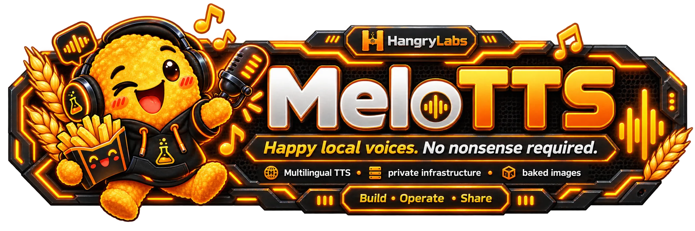
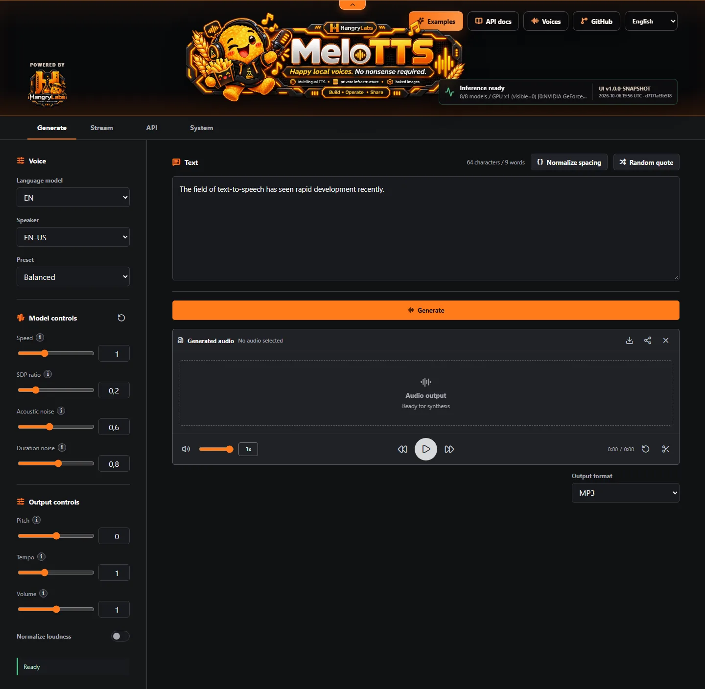

<p align="center">
  <a href="https://hangrylabs.app/">
    
  </a>
</p>

# Hangry Labs Melo T T S

Easy-to-run, offline-friendly multilingual text to speech with a complete browser workspace and HTTP API in one Docker image.

This Hangry Labs fork turns the original MeloTTS research project into a practical application for home users, developers, and production evaluation. The full image contains every supported language model; the smaller English-family image contains the three English model generations. Once downloaded, either image can run without live model downloads.

Official images are published on [Docker Hub](https://hub.docker.com/r/hangrylabs/melotts/tags) and [GitHub Container Registry](https://github.com/hangry-labs/MeloTTS/pkgs/container/melotts).

## Contents

- [Listen and Have a Look](#listen-and-have-a-look)
- [Quick Start](#quick-start)
- [API Usage](#api-usage)
- [About This Fork](#about-this-fork)
- [Support and Issues](#support-and-issues)
- [Docker Images](#docker-images)
- [Local Development](#local-development)
- [Version History](#version-history)
- [License](#license)

---

## Listen and Have a Look

[Open the interactive voice examples](https://hangry-labs.github.io/MeloTTS/examples/) to compare every bundled language and English accent. The browser application at `http://localhost:8888` adds waveform playback and trimming, generation and sentence-streaming workspaces, model controls, output controls, live API discovery, model residency management, and GPU telemetry.

<p align="center">
  <a href="assets/ui.webp">
    
  </a>
</p>

Featured samples: [British English](examples/melotts-en-br.mp3), [newest English model](examples/melotts-en-newest.mp3), [Spanish](examples/melotts-es.mp3), [French](examples/melotts-fr.mp3), [Chinese](examples/melotts-zh.mp3), [Japanese](examples/melotts-jp.mp3), and [Korean](examples/melotts-kr.mp3).

<details>
<summary>All direct MP3 links</summary>

| Language or model | Sample |
| --- | --- |
| English British | [Listen](examples/melotts-en-br.mp3) |
| English newest | [Listen](examples/melotts-en-newest.mp3) |
| English v2 | [Listen](examples/melotts-en-v2.mp3) |
| English | [Listen](examples/melotts-en.mp3) |
| English Indian | [Listen](examples/melotts-en-india.mp3) |
| English Australian | [Listen](examples/melotts-en-au.mp3) |
| English American | [Listen](examples/melotts-en-us.mp3) |
| English default | [Listen](examples/melotts-en-default.mp3) |
| Spanish | [Listen](examples/melotts-es.mp3) |
| French | [Listen](examples/melotts-fr.mp3) |
| Chinese | [Listen](examples/melotts-zh.mp3) |
| Japanese | [Listen](examples/melotts-jp.mp3) |
| Korean | [Listen](examples/melotts-kr.mp3) |

</details>

---

## Quick Start

### Current Snapshot

Run the complete multilingual image with NVIDIA GPU acceleration:

```bash
docker run --rm -p 8888:8888 --gpus all hangrylabs/melotts:latest
```

Use `hangrylabs/melotts:latest_en` for the smaller image containing `EN`, `EN_V2`, and `EN_NEWEST`. Omit `--gpus all` to run on CPU, or use `--gpus "device=1"` to select a specific GPU.

Then open [http://localhost:8888](http://localhost:8888). The UI and API are served together; interactive OpenAPI documentation is available at [http://localhost:8888/tts/docs](http://localhost:8888/tts/docs).

### Stable Release

Pin a release tag for repeatable deployments. Full images use `<version>` and English-family images use `<version>_en`:

```bash
docker run --rm -p 8888:8888 --gpus all hangrylabs/melotts:v0.1.0
docker run --rm -p 8888:8888 --gpus all hangrylabs/melotts:v0.1.0_en
```

---

## API Usage

<details>
<summary>Native generation, controls, streaming, and discovery</summary>

Generate compact MP3 audio:

```bash
curl -X POST "http://localhost:8888/tts/generate" \
  -H "Content-Type: application/json" \
  -d '{"text":"Hello world!","language":"EN","speaker_id":"EN-BR","format":"mp3"}' \
  -o output.mp3
```

The API defaults remain backward compatible: omitted controls are neutral, and omitted `format` returns WAV. The deprecated `POST /tts/convert/tts` route remains available for existing clients.

### Synthesis Controls

| Field | Range and default | Behavior |
| --- | --- | --- |
| `speed` | `0.5` to `2.0`, default `1.0` | Native model speaking speed. |
| `sdp_ratio` | `0.0` to `1.0`, default `0.2` | Blend between deterministic and stochastic duration prediction. |
| `noise_scale` | `0.0` to `1.5`, default `0.6` | Native acoustic sampling variation. |
| `noise_scale_w` | `0.0` to `1.5`, default `0.8` | Native duration sampling variation. |
| `pitch_semitones` | `-12` to `12`, default `0` | Optional FFmpeg pitch shift after synthesis. |
| `tempo` | `0.5` to `2.0`, default `1.0` | Optional FFmpeg tempo change independent of pitch. |
| `volume` | `0.0` to `2.0`, default `1.0` | Optional output volume multiplier. |
| `normalize` | boolean, default `false` | Optional EBU-style loudness normalization. |

MeloTTS does not expose a trained emotion label, style token, reference-audio prompt, or direct emotional-intensity input. The stochastic controls can vary delivery, and pitch/tempo can reshape the result, but the application does not mislabel those effects as native emotion control.

Neutral output-control defaults skip the extra FFmpeg pass. For local non-Docker use, FFmpeg must be installed only when pitch, tempo, volume, or normalization is changed.

### Streaming

```bash
curl -X POST "http://localhost:8888/tts/stream" \
  -H "Content-Type: application/json" \
  -d '{"text":"First sentence. Second sentence.","language":"EN","speaker_id":"EN-BR","stream_format":"mp3"}' \
  -o output.mp3
```

Streaming is sentence-level because the model emits complete sentence segments rather than token-level audio. `pcm_s16le` and MP3 streams are supported; output controls are applied per sentence chunk.

### Discovery and Operations

| Endpoint | Purpose |
| --- | --- |
| `GET /tts/status` | Version, build, runtime, languages, controls, and formats. |
| `GET /tts/defaults` | UI texts, presets, neutral output controls, and capability metadata. |
| `GET /tts/languages` | Configured and loaded language models. |
| `GET /tts/voices` | Language/model inventory and speakers. |
| `GET /tts/speakers?language=EN` | Speakers for one language model. |
| `GET /tts/formats` | File output formats and aliases. |
| `GET /tts/stream-formats` | Streaming formats and transport notes. |
| `POST /tts/load` | Load a configured model on demand. |
| `POST /tts/purge` | Keep one loaded model and release the others. |

The running service is the source of truth for exact schemas: open `/tts/docs` or inspect `/tts/openapi.json`.

</details>

---

## About This Fork

This independently maintained Hangry Labs fork focuses on simple deployment, offline operation, a complete browser UI, and application-friendly APIs. It is based on the original [MeloTTS](https://github.com/myshell-ai/MeloTTS) by Wenliang Zhao, Xumin Yu, and Zengyi Qin.

The original project and this fork are MIT licensed. Original attribution is preserved in [`LICENSE`](LICENSE); Hangry Labs copyright covers the Docker packaging, browser application, API integration, documentation, release tooling, and other fork-specific work.

This project is maintained for usability and convenience by a small team. Evaluate security, capacity, observability, and availability requirements before critical production deployment.

## Support and Issues

Open a [GitHub issue](https://github.com/hangry-labs/MeloTTS/issues) for reproducible bugs or feature requests, and include logs, error messages, runtime details, and reproduction steps. Use [GitHub Discussions](https://github.com/hangry-labs/MeloTTS/discussions) for general questions and design ideas.

---

## Docker Images

<details>
<summary>Registries, variants, and offline behavior</summary>

Images are published to [Docker Hub](https://hub.docker.com/r/hangrylabs/melotts/tags) and [GHCR](https://github.com/hangry-labs/MeloTTS/pkgs/container/melotts).

| Variant | Current tag | Release tag | Included models |
| --- | --- | --- | --- |
| Full | `latest` | `<version>` | `EN`, `EN_V2`, `EN_NEWEST`, `ES`, `FR`, `ZH`, `JP`, `KR` |
| English family | `latest_en` | `<version>_en` | `EN`, `EN_V2`, `EN_NEWEST` |

Both variants include the browser UI and HTTP API, pinned Python dependencies, audio tooling, and baked model assets. After the initial pull they can run without Hugging Face access. Set `TTS_LANGUAGES` to limit which baked models are loaded at startup.

</details>

---

## Local Development

<details>
<summary>Validation and Docker workflows</summary>

This repository targets Python 3.13. Install [Task](https://taskfile.dev/) and `uv`, then use the repository workflows:

```bash
task doctor
task validate
task image
task localdev
```

`task image` builds the full local image. `task imagesmall` builds the English-family image. After one image build, `task localdev` bind-mounts `melo/`, `assets/`, and `VERSION` for rapid backend and UI iteration without rebuilding model layers. See [`docs/notes.md`](docs/notes.md) for copy-paste setup, dependency-resolution, testing, and release notes.

</details>

---

## Version History

### v1.0.0 (in development)
- Replaced the Gradio interface with the shared Hangry Labs standalone FastAPI UI architecture used by KokoroTTS.
- Added responsive expanded/compact branding, local Lucide icons, WaveSurfer playback and trimming, Generate/Stream/API/System workspaces, model residency controls, and complete demand-driven GPU telemetry with history, hover details, and bounded sampling.
- Added `POST /tts/load` for loading configured models on demand; existing API behavior and the WAV default remain backward compatible.
- Moved the Docker and package baseline to Python 3.13 and CUDA 13.0 PyTorch wheels.
- Removed Gradio and the obsolete `cached-path` dependency branch, then regenerated the Python 3.13 lockfile from `requirements.in`.
- Expanded rapid local iteration tasks to mount the complete `melo/`, `assets/`, and `VERSION` surface without rebuilding the image.
- Made full images and normal local runs explicitly default to all language families; EN images default to `EN`, `EN_V2`, and `EN_NEWEST`.
- Consolidated Docker publication into one strict, metadata-rich pipeline for matching Docker Hub and GHCR full/English-family images.
- Replaced legacy artwork with optimized WebP sets for Melo T T S product surfaces and Hangry Labs organization surfaces.
- Added structural tests for the standalone browser workspace.
- Replaced legacy `setup.py` packaging with `pyproject.toml`; wheels now include the runtime `VERSION`, WebP artwork, standalone UI, and CLI entry points.
- Prevented synthesis text from being written to application logs and serialized inference with model load/purge operations for predictable GPU use.
- Fixed CLI speaker selection for every English model family instead of assuming `EN-Default` exists.
- Added API, CLI, package-contract, and wheel-content tests plus standard `doctor`, `deps`, `lint`, `test`, `package`, and `validate` Taskfile workflows.
- Regenerated the deployment lock for Linux/Python 3.13 and tightened Docker build context exclusions for tests and private agent files.
- Added optional pitch, tempo, volume, and loudness-normalization controls to the UI, generation API, and sentence-streaming API while keeping neutral defaults backward compatible.
- Documented the distinction between native Melo synthesis controls, post-processing controls, and unsupported named-emotion conditioning.
- Reorganized the README around examples, startup, API use, images, development, project context, and release history.

<details>
<summary>Earlier releases</summary>

### v0.1.0 (11.05.2026)
- Moved the active Docker runtime/build baseline from `python:3.10-slim` to `python:3.11-slim`.
- Raised package metadata from `python_requires>=3.10` to `python_requires>=3.11`.
- Refreshed dependency pins for the Python 3.11 line, including newer `numpy`, `pandas`, and `networkx` pins.
- Validated the EN-focused Docker build on Python 3.11 with `task imagesmall`, `python -m pip check`, and `task localapi`.
- Added `POST /tts/generate` as the preferred synthesis endpoint while keeping legacy `POST /tts/convert/tts` for backward compatibility.
- Added `POST /tts/stream` for sentence-level streaming responses plus `GET /tts/stream-formats` for discovery. The model does not emit token-level audio; streaming starts after each sentence segment is synthesized.

### v0.0.8 (10.05.2026)
- Scope: runtime-focused cleanup for the Docker UI/API fork.
- Removed unused upstream training surfaces, including training scripts/modules, training example data, legacy script-style package tests, and original upstream docs that no longer matched this fork.
- Trimmed runtime helper code by reducing `melo/utils.py` to inference text preparation, config loading, and `HParams`.
- Removed stale phonemizer generation artifacts and notebook files that were not read by runtime synthesis.
- Cleaned stale imports, unused locals, and unreachable flow-layer code found by lint checks.
- Improved Taskfile API readiness checks by retrying transient startup errors such as `Empty reply from server`.
- Reworked the UI into a Kokoro-style Gradio layout while keeping MeloTTS language, speaker, preset, and advanced synthesis controls.
- Added text metrics, per-language random quotes, voice inventory, synthesis presets, advanced controls, Gradio audio waveform preview, runtime metadata, favicon/brand icon, and richer API documentation links.
- Added `/tts/status`, `/tts/defaults`, `/tts/voices`, `/tts/metrics`, and `/tts/purge` endpoints for the new UI and companion integrations.
- Added backward-compatible optional API output formats: default WAV plus MP3, FLAC, and Ogg Vorbis via `format`, with discovery at `/tts/formats`.
- Added an output format selector to the Gradio UI; the UI defaults to MP3 while the API remains WAV-by-default for old clients.
- Modernized the runtime dependency stack using `requirements.in` + resolved pins in `requirements.txt`; key validated versions include `gradio==6.14.0`, `fastapi==0.136.1`, `starlette==1.0.0`, `pydantic==2.13.4`, `torch==2.11.0`, `torchaudio==2.11.0`, `transformers==5.8.0`, `numpy==2.2.6`, and `soundfile==0.13.1`.
- Normalized package metadata versioning in `setup.py` so display versions like `v0.0.8-SNAPSHOT` install as valid Python package versions such as `0.0.8.dev0`.
- Added `task release` backed by the root snapshot `VERSION` file, and corrected Docker release tags so the full image publishes as `<version>` while the EN-focused image publishes as `<version>_en`.
- Expanded rapid local iteration tasks so `task localrun`, `task localdev`, and `task localapi` bind-mount `melo/app.py`.
- Documentation: corrected API examples to use `/tts/convert/tts` JSON payloads and documented the current runtime-only scope.
  ```bash
  docker run -p 8888:8888 --gpus all hangrylabs/melotts:v0.0.8_en
  docker run -p 8888:8888 --gpus all hangrylabs/melotts:v0.0.8
  docker run -p 8888:8888 --gpus "device=1" hangrylabs/melotts:v0.0.8_en
  ```


### v0.0.7 (29.03.2026)
- Upgraded Docker runtime/build baseline to Python 3.10 (`python:3.10-slim`) and aligned packaging with `python_requires>=3.10`.
- Reworked app versioning/build metadata:
  - Root `VERSION` file is now the single version source of truth.
  - Build metadata is generated at image build time (no hardcoded `BUILD_ID`) and exposed in UI/API.
- Upgraded web stack to newer compatible releases: `gradio==4.44.1`, `gradio-client==1.3.0`, `fastapi==0.115.12`, `starlette==0.46.2`, `typer==0.12.5`.
- Applied large dependency/security refresh with pinned versions for reproducible builds, including network/security-sensitive packages such as `requests==2.32.4`, `urllib3==2.3.0`, `certifi==2025.6.15`, plus broad runtime library updates.
- Added/kept compatibility guardrails for stability:
  - `markupsafe` remains on 2.x for Gradio compatibility.
  - `huggingface-hub==0.21.4` and `filelock==3.13.1` remain constrained by `cached-path==1.6.2`.
- Improved offline reliability and startup resilience:
  - Build-time preload profiles (`EN_ONLY` / `FULL`) with retry + strict/non-strict controls.
  - NLTK resources required for EN synthesis (including `averaged_perceptron_tagger_eng` and `cmudict`) are preloaded during image build for offline-ready runs.
- Fixed Gradio 4.x UI regressions after upgrades (language/speaker loading + synth output compatibility) while keeping API behavior stable.
- Split Docker release flow into EN and FULL image tracks/workflows (`<version>_en`, `<version>`) to improve build/release flexibility.
- Run with:
  ```bash
  docker run -p 8888:8888 --gpus all hangrylabs/melotts:v0.0.7_en
  docker run -p 8888:8888 --gpus all hangrylabs/melotts:v0.0.7
  docker run -p 8888:8888 --gpus "device=1" hangrylabs/melotts:v0.0.7_en
  ```
  https://hub.docker.com/r/hangrylabs/melotts

### v0.0.6 (27.03.2026)
- Model loading is now much faster (from ~30 seconds down to only a few seconds in testing).
- Added working RTX 50-series (`sm_120`) support in the Docker setup.
- Added GPU selection support for Docker runs, so you can choose which GPU to use.
- Improved build resilience for model preloading during Docker image creation.
- Run with:
  ```bash
  docker run -p 8888:8888 --gpus all hangrylabs/melotts:v0.0.6
  ```

### v0.0.5 (27.03.2026)
- Added more English model options (including V2 and V3 variants).
- Added UI tabs for `UI Playground` and `API Docs`.
- Added build/version badge in UI (top-right) via `APP_VERSION` and `BUILD_ID`.
- Added memory management in UI (`Purge others`) to release non-selected language models.
- Improved API documentation visibility directly inside the app (`/` -> API Docs tab + `/tts/docs`).
- Updated release planning: V2/V3 scope completed; deferred separate base-repo split plan.
- Run with:
  ```bash
  docker run -p 8888:8888 --gpus all hangrylabs/melotts:v0.0.5
  ```

### v0.0.4 (09.08.2025)
- **Dependency updates** for improved performance and stability.
- **Full offline support** — all required models are now baked into the image.
- **Model overwrite option**: set `MELOTTTS_MODELS` to point to your custom model folder.
- **Smaller image size** via optimized multi-stage Docker build.
- Run with:
  ```bash
  docker run -p 8888:8888 --gpus all hangrylabs/melotts:v0.0.4
  ```

### v0.0.3 (25.07.2025)
- Optimized docker build to use layer caching so we can build stuff fast after the initial build
- Expanded ping to include version and build
- Expanded UI with sdp_ratio, noise_scale and noise_scale_w
- Expanded API with sdp_ratio, noise_scale and noise_scale_w
- Corrected faulty version dates
- Updated documentation
- Run with:
  ```bash
  docker run -p 8888:8888 --gpus all hangrylabs/melotts:v0.0.3
  ```

### v0.0.2 (22.06.2025)
- Enable API calls together with UI
- Added configurable language selection through `TTS_LANGUAGES`.
- Added GPU-enabled Docker execution.

### v0.0.1 (21.06.2025)
- Initial release
- Basic TTS functionality
- Support for English (Default, US, BR, India, AU)
- Docker support for both CPU and GPU
- Web interface on port 8888

</details>

---

## License

This fork is licensed under the [MIT License](LICENSE).
Original work by Wenliang Zhao, Xumin Yu, and Zengyi Qin in [MeloTTS](https://github.com/myshell-ai/MeloTTS).
